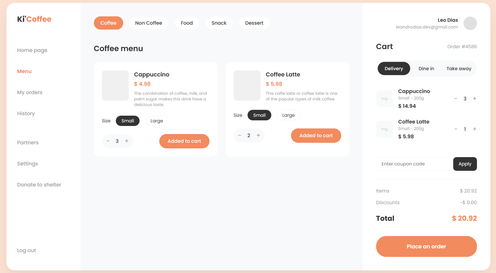

# Ki'Coffee - Point of Sale (POS) Interface ☕🐱

## 📌 Overview
Purr'Coffee is a highly interactive Point of Sale interface designed for cafes. Built entirely without build tools (no Webpack/Vite) to demonstrate profound understanding of the DOM, Native Reactivity (Vue 3 via CDN), and strict CSS architecture using the SCSS 7-1 pattern.

## 🛠 Tech Stack
* **Framework:** Vue.js 3 (Composition/Options API via CDN)
* **Styling:** SCSS (compiled locally) with BEM methodology
* **Architecture:** Monolithic HTML structure with modularized SCSS mapping
* **Deployment:** Vercel / GitHub Pages

## 🏗 Architectural Decisions
1. **Zero-Build Tooling:** Opted for a CDN-based Vue instantiation to focus strictly on state management logic and template binding without the overhead of node environments.
2. **SCSS 7-1 Pattern:** Despite not using Single File Components (.vue), the CSS is strictly modularized into abstracts, base, layout, and components to ensure scalability and maintainability.
3. **Computed Financial Logic:** Cart subtotals, discounts, and final calculations are strictly handled by Vue's `computed` properties to ensure derived state is always perfectly synced with the cart array.

## 🚀 Key Features
* **Reactive Cart Management:** Real-time updates for adding/removing items, adjusting quantities, and preventing duplicate entries.
* **Dynamic Filtering:** Category-based product rendering.
* **Stateful Checkout:** Integrated coupon logic (e.g., applying dynamic discounts based on state rules).
* **A11y Considerations:** Semantic HTML5 landmarks (`<aside>`, `<main>`) ensuring structural accessibility.

## ⚙️ Local Setup
Since this project requires no package managers, running it locally is straightforward:
1. Clone the repository: `git clone https://github.com/leandro-dias/kicoffee.git`
2. Open `index.html` in your browser or use the **Live Server** extension in VSCode.
3. *Optional:* If you wish to edit styles, run the **Live Sass Compiler** extension to watch the `/scss` directory and output to `/css/main.css`.
